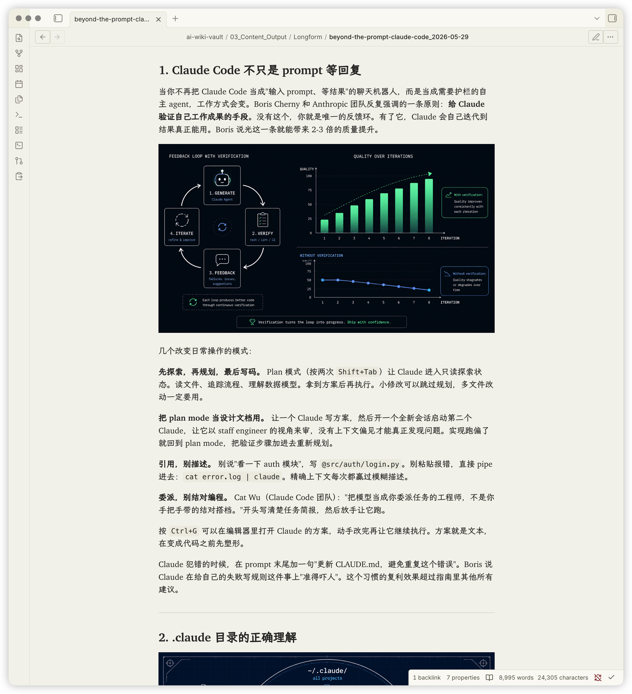
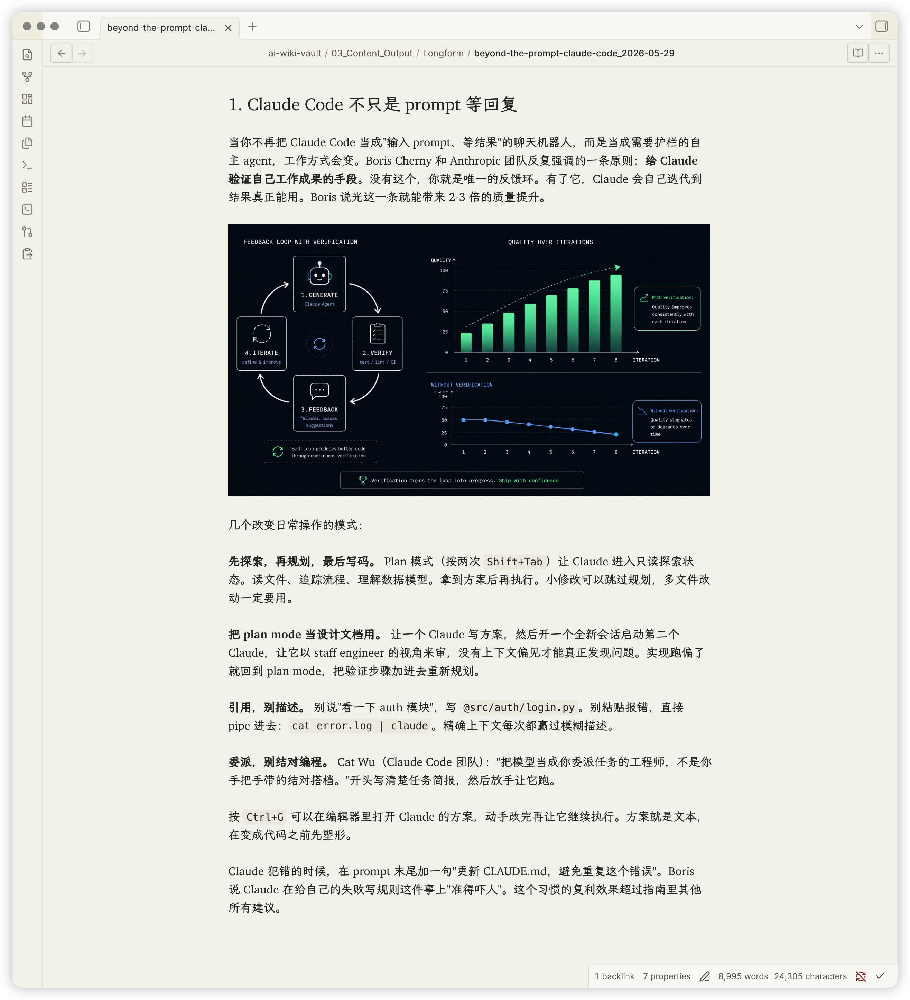
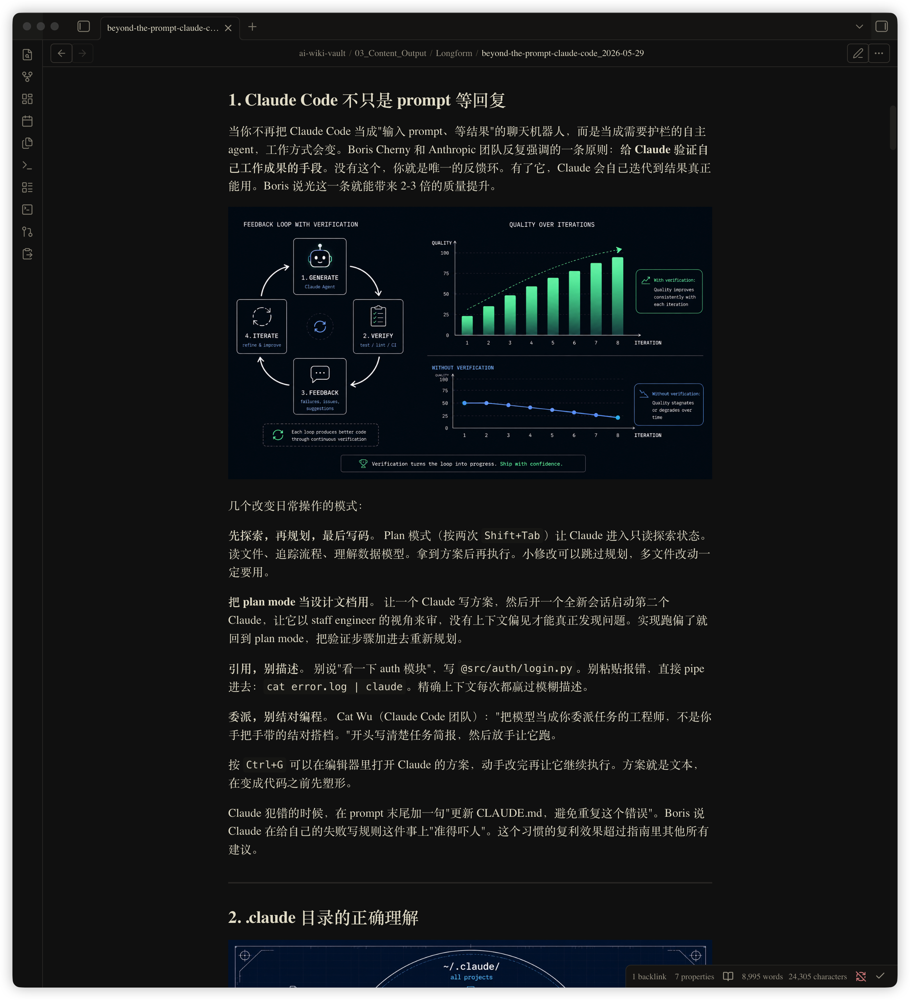
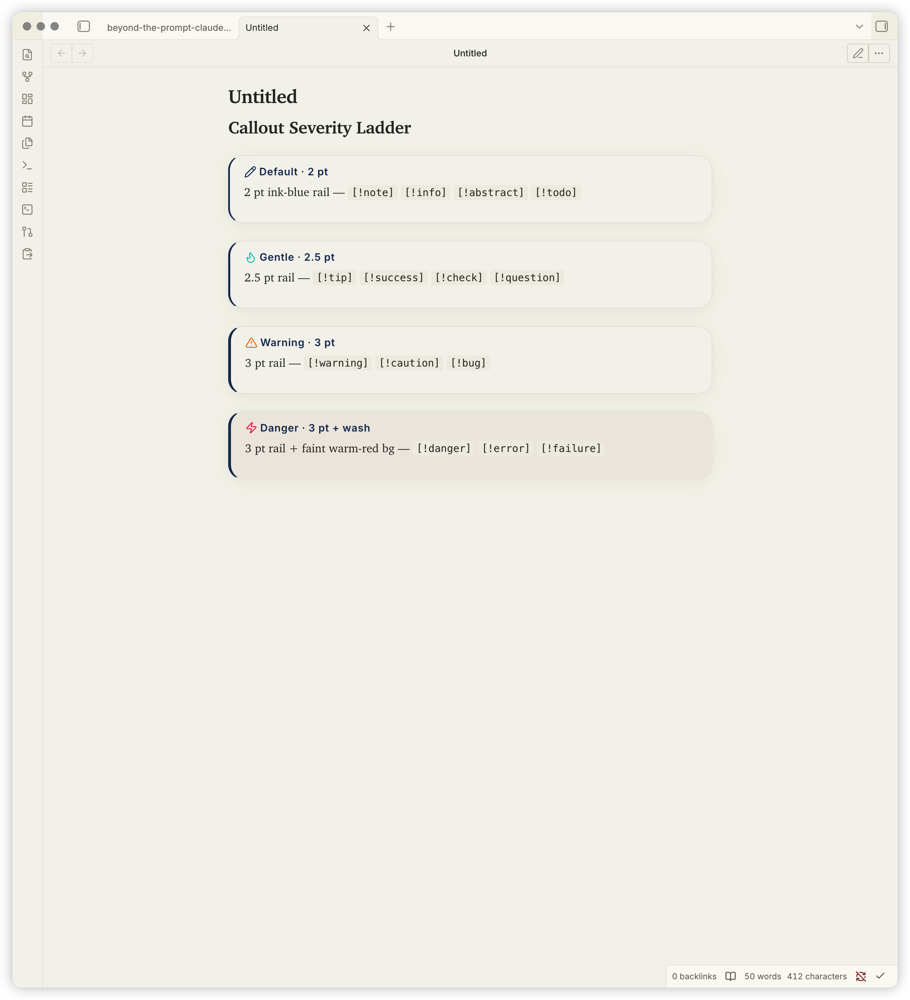
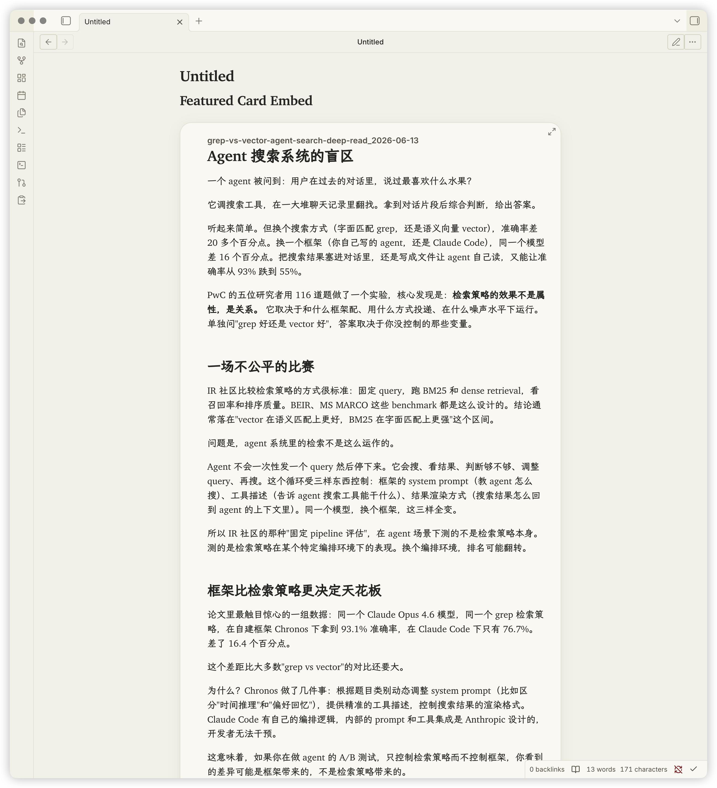
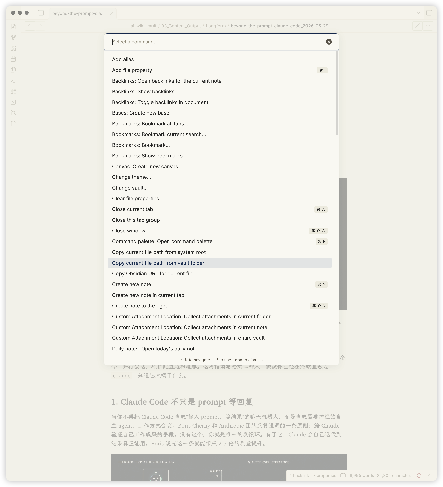
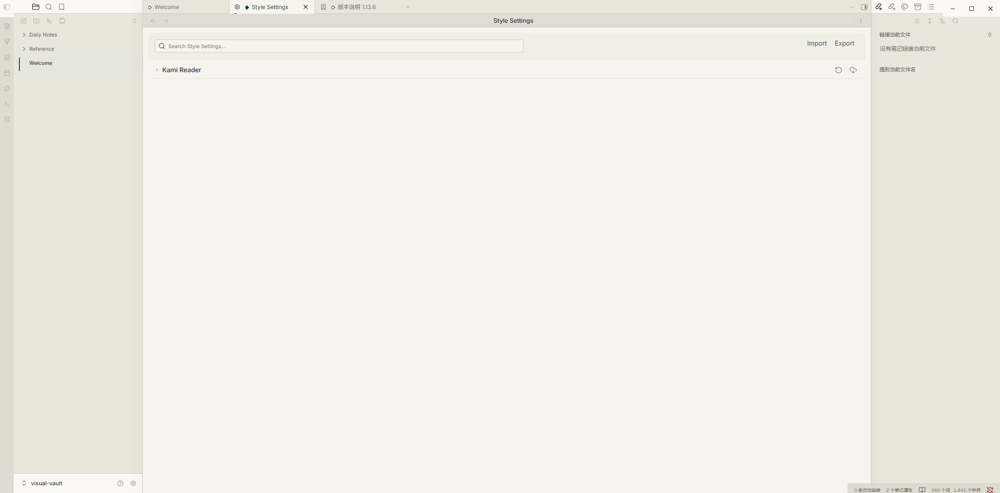
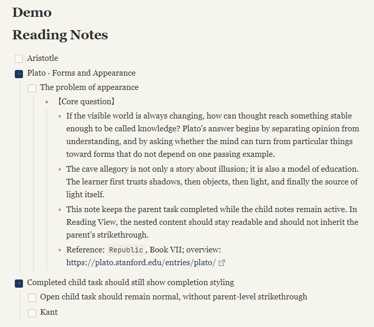

# Kami Reader — Obsidian Theme

[English](./README.md) | [简体中文](./README.zh-CN.md)

> Last updated: 2026-07-13

> **Inspired by [tw93/kami](https://github.com/tw93/kami). Not affiliated with or
> endorsed by tw93. All visual design tokens trace to the original kami project
> (MIT); this repo is an Obsidian-side adaptation.**

An Obsidian theme inspired by [tw93/kami](https://github.com/tw93/kami). Translates
kami's print-grade typographic system — warm parchment surface, ink-blue accent,
serif-led hierarchy, warm-gray neutrals — onto the Obsidian editor.

> Status: **Published on the [Obsidian Theme Gallery](https://community.obsidian.md/themes/kami-reader).**
> Public repo: https://github.com/KKenny0/obsidian-kami · Latest release: `0.1.9`

---

## Visual Language

Aligned to [kami v1.1.0](https://kami.tw93.fun/index-zh.html).

| Token | Light | Dark | Role |
|---|---|---|---|
| Parchment / Deep Dark | `#f5f4ed` | `#141413` | Primary note background |
| Ivory / Dark Ivory | `#faf9f5` | `#1a1917` | Sidebars, surfaces |
| Warm Sand | `#e8e6dc` | `#353330` | Borders, dividers |
| Dark Surface / Warm Ivory | `#30302e` | `#e8e3d2` | Body text |
| Ink Blue / Ink Light | `#1B365D` | `#2D5A8A` | Accent: headings, links, selection, CTA |
| Olive | `#504e49` | `#b4b09e` | Quote / caption text |
| Warm Highlight | `#f3e3a8` | `#5a4a1f` | `==mark==` highlight |
| Tag Tint | `#E4ECF5` | `#E4ECF5` | Tag background (solid, never rgba) |

All neutrals carry a yellow-brown warm undertone (no cold blue-grays) in **both**
light and dark variants. Ink blue is used sparingly — the print-design ≤5% rule
is relaxed for the editor context but the intent holds: accent only, never chrome.

---

## Screenshots

| Reading View (Light) | Editing View (Light) |
|---|---|
|  |  |

| Reading View (Dark) | Callout Severity Ladder |
|---|---|
|  |  |

| Featured Card Embed | Command Palette | Settings Panel |
|---|---|---|
|  |  |  |

| Task Completion in Nested Lists |
|---|
|  |

Screenshots are captured in [`screenshots/`](./screenshots/). See
[`screenshots/SCREENSHOTS.md`](./screenshots/SCREENSHOTS.md) when refreshing
the set for a new release.

---

## Style Settings

This theme ships a [Style Settings](https://github.com/obsidianmd/obsidian-style-settings) schema for the variables users are most likely to tune. No CSS editing is required.

After installing the Style Settings community plugin, go to **Settings → Style Settings → Kami Reader** to adjust:

- **Body font family** — swap LXGW WenKai Screen (kaiti) for Source Han Serif (songti) if kaiti fatigues
- **Body line-height** — 1.55 default, range 1.3–1.9 (Live Preview needs Cmd+E toggle after change; Reading View updates instantly)
- **Note max width** — 700px default
- **Bold emphasis strength** — without a Style Settings override, 500 in Light and 600 in Dark by default; choose 500, 600, or 700 if your font setup needs a different calibration
- **Accent color** (light + dark) — single accent swap, instantly re-themes
- **Primary background** (light + dark) — tune parchment warmth

The schema intentionally exposes only 6 high-leverage variables. Everything else stays fixed in `theme.css` to honor kami's restraint principle: too many switches would dilute the design system.

<details>
<summary>Schema locations for maintainers</summary>

- **Snippet mode**: schema embedded as `/* @settings ... */` YAML at the top of `theme.css`. Style Settings does not scan `.obsidian/snippets/` for standalone JSON files, so snippet installs need the schema inside the CSS.
- **Theme mode**: schema in root `data-theme.json`. Obsidian reads it when the theme is installed under `.obsidian/themes/kami-reader/`.

Keep both schema copies in sync when changing user-facing settings.
</details>

---

## Typography

```css
--font-text-theme: "Charter", "Georgia",
                   "LXGW WenKai Screen", "LXGW WenKai",
                   "Source Han Serif SC", "Noto Serif CJK SC",
                   "Songti SC", "STSong", "SimSun", serif;
```

- **Charter** — English serif. macOS-native (`/System/Library/Fonts/Charter.ttc`),
  no install needed. Falls back to Georgia on other platforms. This is the font
  kami itself uses for English.
- **LXGW WenKai Screen** — CJK 楷书, OFL 1.1. Screen variant optimized for
  low-DPI displays. Closes the gap with kami's original 仓耳今楷02 (which is
  commercial-restricted).
- **JetBrains Mono** — Code, OFL 1.1.
- **Inter** — UI / interface, OFL 1.1.

### Optional font install

Only LXGW WenKai Screen needs manual install. Without it, CJK falls back to
`Songti SC` (macOS) / `SimSun` (Windows) — readable but loses the kaiti warmth.

- **LXGW WenKai Screen** — https://github.com/lxgw/LxgwWenKai-Screen/releases
  (grab `LXGWWenKaiScreen-Regular.ttf` + `Bold.ttf`)
- JetBrains Mono (optional, code already falls back to SF Mono / Cascadia):
  https://www.jetbrains.com/lp/mono/

---

## Installation

### From Obsidian Theme Gallery (recommended)

1. Obsidian → **Settings → Appearance** → click **Manage** next to Themes
2. **Browse** → search "Kami Reader" → **Install** → **Use**
3. (Optional) Install the [Style Settings](https://obsidian.md/plugins?id=obsidian-style-settings) community plugin for the 6 tunable variables (font, line-height, width, bold emphasis, accent, background)

Gallery installs are unaffected by the macOS Sequoia sandbox issue described below. Obsidian writes the theme files itself, so App Store users can install Kami Reader cleanly from Browse Themes.

### Manual install / developer iteration (macOS Sequoia sandbox workaround)

> ⚠️ **Why this section exists.** Mac App Store Obsidian runs in a sandbox.
> macOS Sequoia 15+ tags every file created by `cp` from Terminal with
> `com.apple.provenance`. The sandbox then refuses to load those files as
> theme resources — Obsidian silently skips the theme folder. This matters
> for **developers iterating on theme.css** who copy files into their own
> vault's `.obsidian/themes/` directory. End users installing via Gallery
> (the path above) are not affected.

The workaround for local iteration: ship kami as a **CSS snippet** instead of a
theme, and inject it via Obsidian's own Vault API from the DevTools console.
Files written by `app.vault` carry Obsidian provenance and load normally.

#### One-time setup

1. Confirm Appearance → Themes is set to **Default** (no other theme should
   be active; another theme's `body.<name>-theme` class will out-spec kami's
   `body.theme-light` selector).
2. From this directory, generate the inject script:
   ```bash
   ./sync.sh
   ```
3. Open the generated `inject-kami-snippet.js`, `Cmd+A` select all, `Cmd+C` copy.
4. In Obsidian: `Cmd+Option+I` → Console tab → `Cmd+V` paste → Enter.
   You should see `✓ kami.css created (... chars)`.
5. Settings → Appearance → scroll to **CSS Snippets** → enable **kami**.

#### Iterating on the CSS

```bash
# Edit theme.css, then:
./sync.sh
# Re-copy inject-kami-snippet.js contents → paste into Obsidian Console.
# Then toggle the kami snippet off → on to force reload.
```

Hot-reload of modified snippets is **not** automatic — Obsidian reads snippet
files at startup. After re-injecting via `app.vault.modify`, toggle the snippet
off and on in Settings → Appearance → CSS Snippets to pull the new content.

---

## Coverage

Phase 1 targets full visual coverage:

- ✅ Base color tokens (60+ variables, both light and dark palettes)
- ✅ **Dark variant** — Deep Dark `#141413` + Ink Light `#2D5A8A`, preserving
  the same yellow-brown undertone and single-accent restraint as light mode.
- ✅ Reading View: headings, body, lists (native markers), tables, blockquote
  (2pt ink-blue rail + olive text, no bg), code, frontmatter, embeds
- ✅ Editing View (CodeMirror 6): syntax tokens, cursor, selection, active
  line, formatting marks
- ✅ UI chrome: titlebar, tabs, ribbon, file explorer, status bar, command
  palette, settings panel, modals, menus, toggles, checkboxes, scrollbars
- ✅ Reduced-motion preference respected

Not covered (deferred):
- PDF Export stylesheet (kami is print-native; this is a Phase 1.5 candidate)
- Plugin-specific overrides (Dataview, Templater, Excalidraw) — verify as
  encountered

---

## Publishing Notes

Kami Reader is published on the Obsidian Theme Gallery:
https://community.obsidian.md/themes/kami-reader.

Obsidian pulls theme files from the GitHub release tag matching
`manifest.json.version` exactly, with no `v` prefix.

<details>
<summary>Maintainer history: Gallery submission and lint fixes</summary>

The theme was published through `community.obsidian.md` on 2026-06-20. That site
mirrors accepted themes to `obsidianmd/obsidian-releases` through Obsidian's
hourly mirror workflow.

The Theme Gallery downloader was also checked against the macOS Sequoia sandbox
issue: a fresh Gallery install wrote `theme.css` without `com.apple.provenance`,
so App Store users can install through Gallery cleanly. The snippet workaround
only matters for manual developer iteration.

community.obsidian.md runs automated lint on submission. Each warning required
its own fix and a new release tag:

| Release | Lint warning | Fix |
|---|---|---|
| `0.1.0` | No release matches manifest version | Created GitHub release tagged `0.1.0` (no `v` prefix) |
| `0.1.1` | Repository has no recognized license | Restored pure MIT LICENSE (GitHub licensee strictly matches MIT template; attribution appended after standard text broke the match) |
| `0.1.1` | `css-scrollbar` partially supported by Obsidian 1.4.5 | Dropped CSS Scrollbars spec properties (`scrollbar-width`, `scrollbar-color`); kept webkit `::-webkit-scrollbar` vendor extension |
| `0.1.2` | Avoid `!important` at theme.css:788, 1105, 1106 | CodeMirror selection uses 0,3,0 specificity compound selector; reduced-motion uses explicit selector list instead of `* !important` |

</details>

---

## Design Decisions

1. **Forked from Obsidian Default, not Minimal.** Minimal carries its own
   design language; mixing parchment into it produces visual dissonance.
   Minimal also uses `body.minimal-theme` class selectors (specificity 0,1,1)
   that beat kami's old `:root` (0,0,1). Default has no such class.
2. **Variables on `body.theme-light` / `body.theme-dark`, not `:root`.**
   Obsidian's built-in app.css defines base vars under `.theme-light` /
   `.theme-dark` (specificity 0,1,0). `:root` (0,0,1) loses the cascade;
   `body.theme-light` (0,1,1) wins.
3. **Charter, not Newsreader.** kami v1.1.0 specifies Charter for English;
   it's also macOS-native, removing a font-install step.
4. **Tag backgrounds use solid `#E4ECF5`, never rgba.** kami explicitly bans
   rgba tag backgrounds (WeasyPrint double-rect bug in PDF export).
5. **Ring + whisper shadows, never hard drop shadows.** kami spec; hard
   drop shadows look heavy in print and on screen.
6. **Native list markers across Reading and Live Preview.** A Reading-only
   em-dash marker looked elegant but made editing and reading disagree; kami's
   restraint now comes from quiet marker color and tighter nested spacing.
7. **Blockquote: 2pt ink-blue rail + olive text, no background, no italic.**
   Restraint over decoration.
8. **LXGW WenKai Screen over Source Han Serif.** Kami's original (仓耳今楷02)
   is a kaiti; Source Han Serif is a print songti. The kaiti keeps the
   calligraphic warmth that defines kami's character.
9. **No synthetic bold weights.** Kami forbids fake bold; headings use 500/600
   actual weights only.
10. **Shipped as snippet, not theme, in Phase 1.** Workaround for macOS
    Sequoia sandbox; see Installation section.

---

## Known Tradeoffs

1. **The parchment surface is warmer than most editor themes.** If it feels too
   yellow for long sessions, tune **Primary background** in Style Settings.
2. **Kaiti gives Kami Reader its CJK texture, but not every reader likes it for
   daily editing.** If LXGW WenKai Screen feels tiring, switch **Body font
   family** to a songti-style stack such as Source Han Serif SC.
3. **Bold is calibrated per theme:** without a Style Settings override, restrained
   `500` in Light and more salient `600` in Dark. If your platform or font needs
   a different calibration, use **Bold emphasis strength** at `500`, `600`, or `700`.

---

## File Layout

```
kami-obsidian/
├── manifest.json              # Theme metadata (name, version, minAppVersion)
├── theme.css                  # Source of truth for all kami styles + inline @settings YAML
├── data-theme.json            # Style Settings schema for theme-folder mode
├── sync.sh                    # Regenerates inject-kami-snippet.js from theme.css
├── inject-kami-snippet.js     # Generated by sync.sh — paste into Obsidian Console
├── screenshots/               # 7-shot set (see SCREENSHOTS.md)
├── LICENSE                    # MIT (pure text so GitHub licensee detects SPDX:MIT)
├── README.md                  # English docs (this file)
└── README.zh-CN.md            # 简体中文文档
```

`inject-kami-snippet.js` is a **build artifact**, not source. Regenerate via
`./sync.sh` after any `theme.css` change.

---

## Releases

| Tag | Notes |
|---|---|
| [0.1.0](https://github.com/KKenny0/obsidian-kami/releases/tag/0.1.0) | Phase 1: visual system + dark variant + atomic components + Style Settings |
| [0.1.1](https://github.com/KKenny0/obsidian-kami/releases/tag/0.1.1) | Compat: drop CSS Scrollbars spec for Obsidian 1.4.5; restore pure MIT LICENSE |
| [0.1.2](https://github.com/KKenny0/obsidian-kami/releases/tag/0.1.2) | Lint compliance: remove !important from CodeMirror selection + reduced-motion |
| [0.1.3](https://github.com/KKenny0/obsidian-kami/releases/tag/0.1.3) | Polish: align nested list typography, prevent external-link icon overlap, and keep completed parent tasks from striking through child content |
| [0.1.4](https://github.com/KKenny0/obsidian-kami/releases/tag/0.1.4) | Lint compliance: remove broad completed-task selectors while keeping child task content readable |
| [0.1.5](https://github.com/KKenny0/obsidian-kami/releases/tag/0.1.5) | Performance: remove global text rendering override to improve long-note scrolling |
| [0.1.6](https://github.com/KKenny0/obsidian-kami/releases/tag/0.1.6) | Document reading polish: calibrate long-form typography, inline code, code blocks, tables, headings, and bold emphasis |
| [0.1.7](https://github.com/KKenny0/obsidian-kami/releases/tag/0.1.7) | Readability calibration: restore 700px reading width, 500 emphasis, and a calmer long-form rhythm |
| [0.1.8](https://github.com/KKenny0/obsidian-kami/releases/tag/0.1.8) | Style Settings: add a bold emphasis strength control for font/platform readability calibration |
| [0.1.9](https://github.com/KKenny0/obsidian-kami/releases/tag/0.1.9) | Reading View: restore native paragraph rhythm, calibrate dark bold emphasis, and warn when the full Kami snippet overlaps an active theme |

Release tags match `manifest.json` version exactly (no `v` prefix) — Obsidian
pulls theme files from the GitHub release tagged with the manifest version.

---

## License

MIT — see [LICENSE](./LICENSE).

Visual design system source: [tw93/kami](https://github.com/tw93/kami) (MIT).
This theme is a derivative adaptation; all design token values trace to the
original kami project.

Fonts referenced but not bundled:
- Charter (OFL, macOS-native)
- LXGW WenKai / LXGW WenKai Screen (OFL, https://github.com/lxgw/LxgwWenKai)
- JetBrains Mono (OFL)
- Inter (OFL)

---

## Credits

- Visual system & design tokens: [tw93/kami](https://github.com/tw93/kami) — MIT
- Fonts: Charter (OFL, macOS-native), LXGW WenKai (OFL), JetBrains Mono (OFL),
  Inter (OFL)
