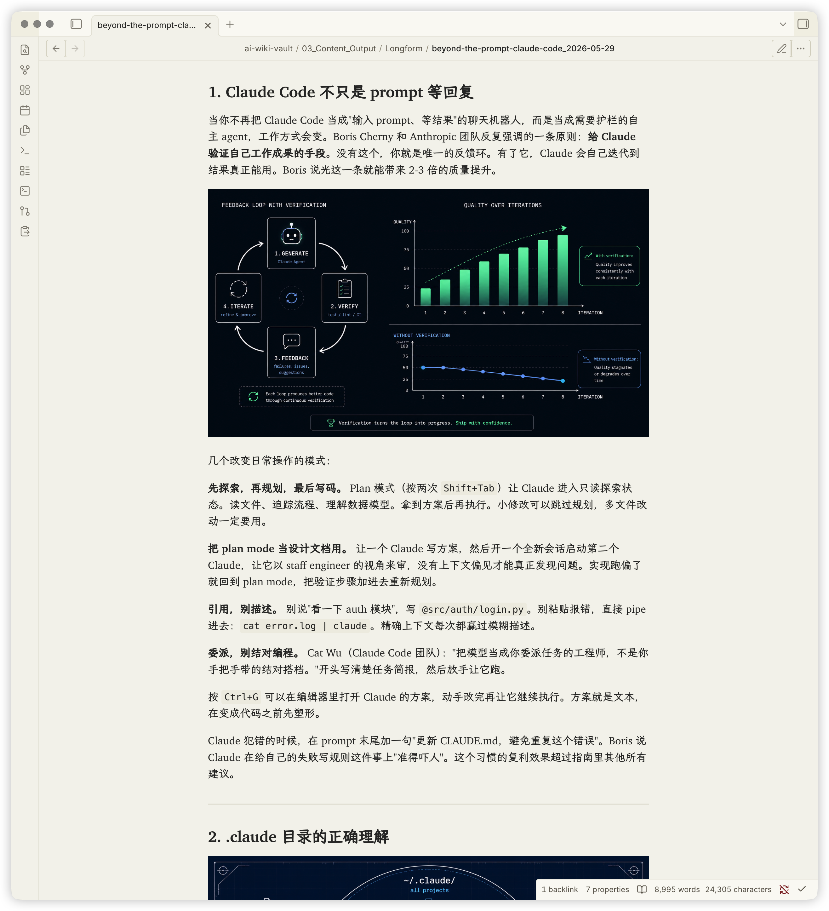
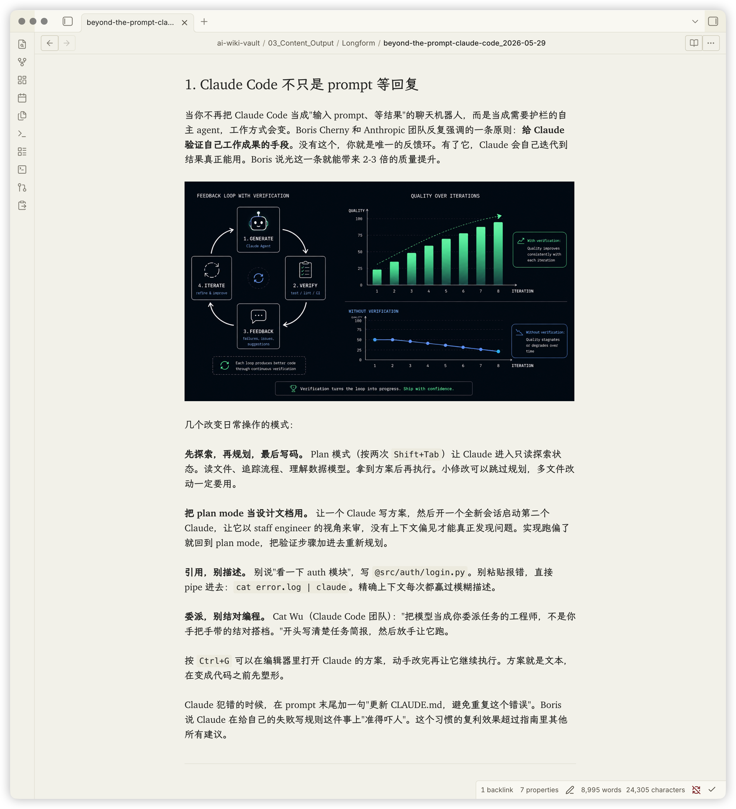
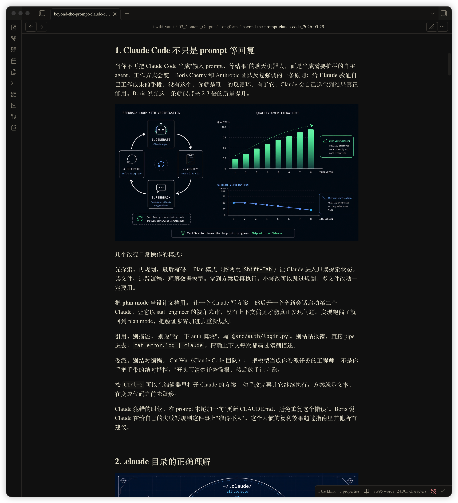
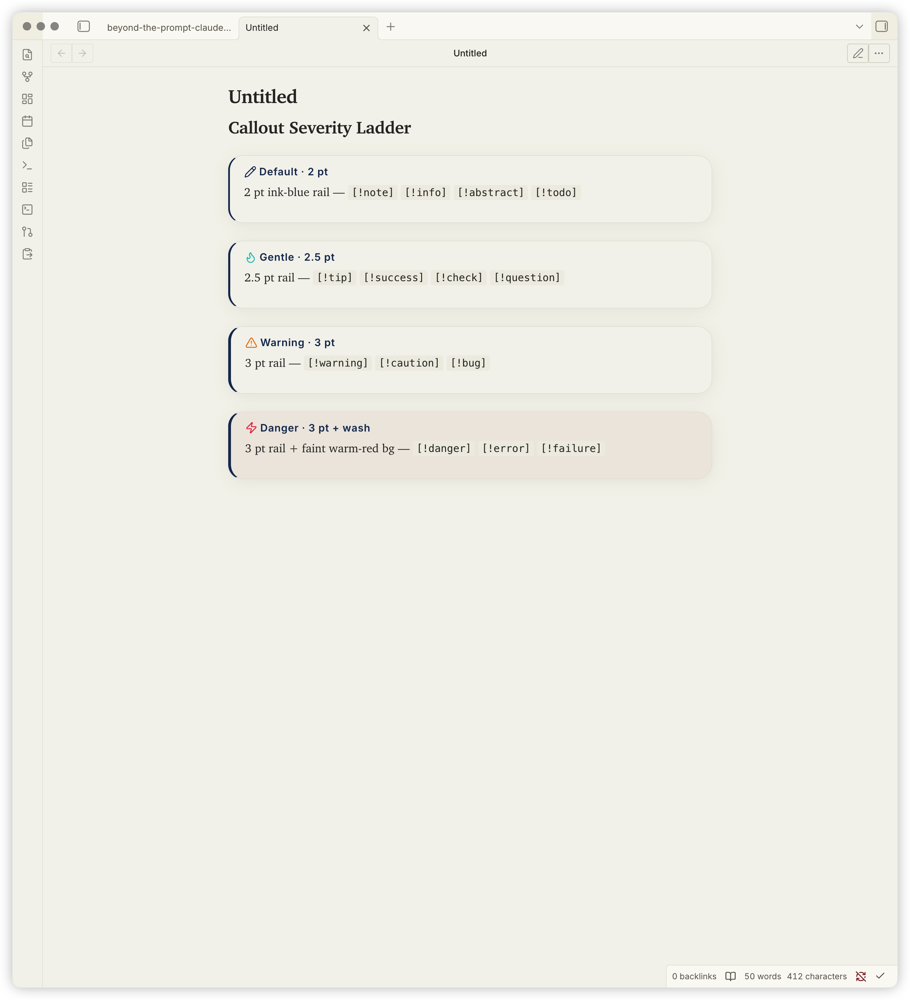
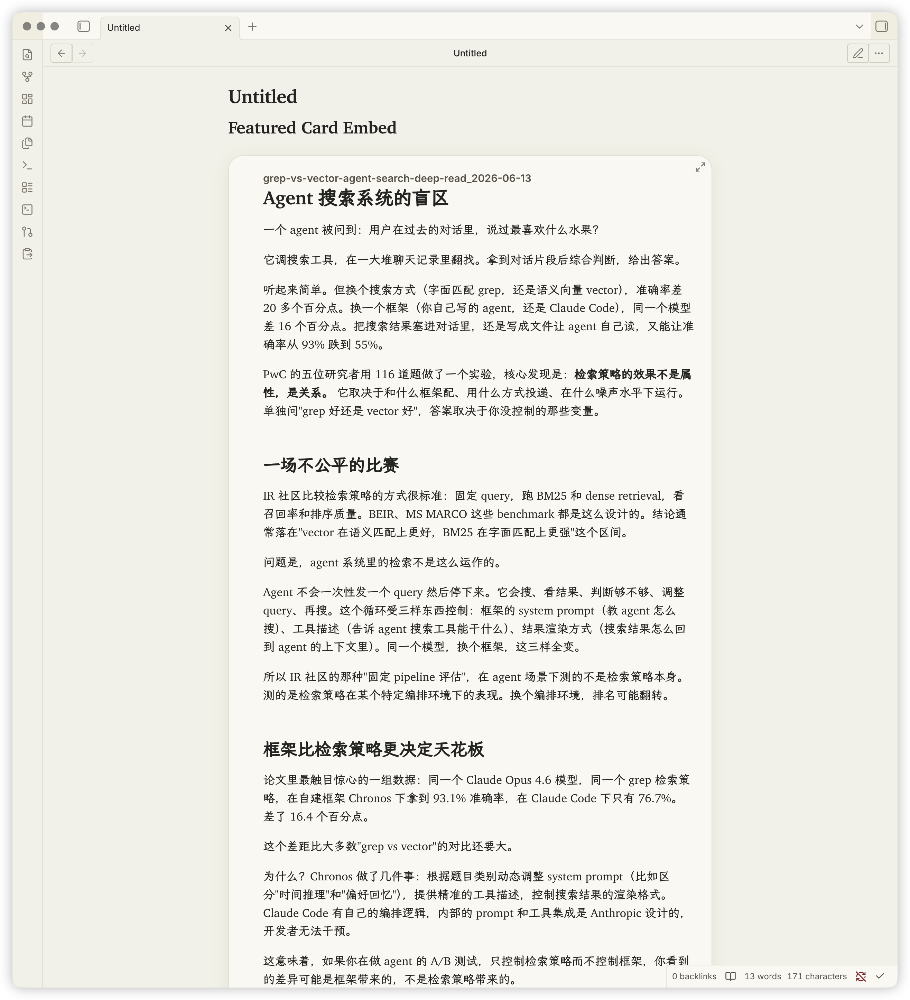
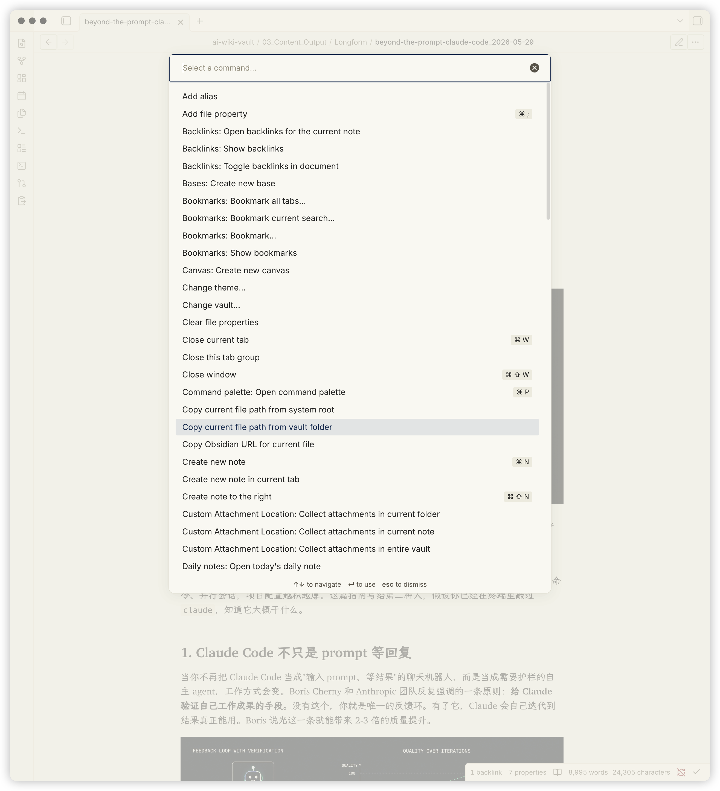
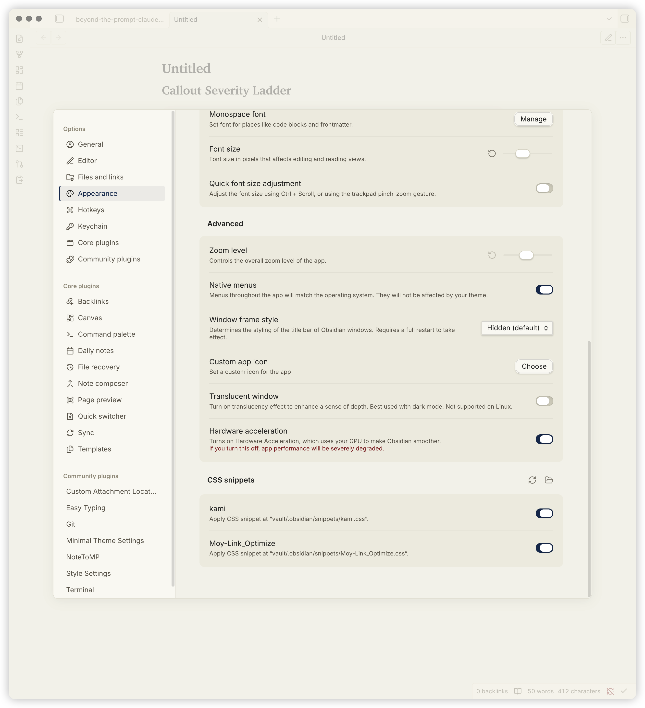
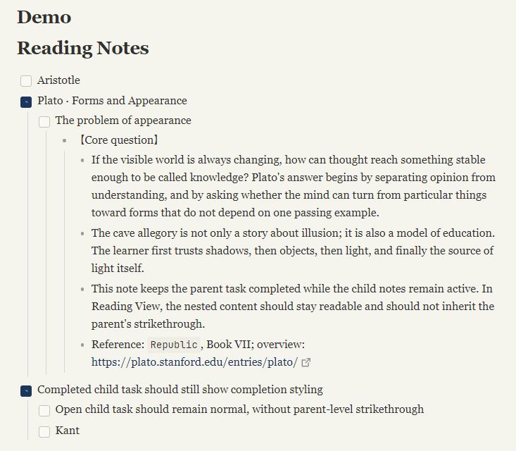

# Kami Reader — Obsidian 主题

[English](./README.md) | 简体中文

> **灵感来源于 [tw93/kami](https://github.com/tw93/kami)。本项目与 tw93 无关联、
> 未受其背书。所有视觉设计 token 均溯源至原 kami 项目（MIT 许可）；本仓库
> 是 kami 设计系统在 Obsidian 端的衍生适配。**

> 最后更新：2026-06-25 · Last updated: 2026-06-25

把 [tw93/kami](https://github.com/tw93/kami) 的印刷级排版系统——暖米纸底色、
油墨蓝点缀、衬线主导的层级、暖调中性灰——搬到 Obsidian 编辑器上。

> 当前状态：**已上线 [Obsidian Theme Gallery](https://community.obsidian.md/themes/kami-reader)。**
> 公开仓库：https://github.com/KKenny0/obsidian-kami · 最新 release：`0.1.4`

---

## 视觉语言

对齐 [kami v1.1.0](https://kami.tw93.fun/index-zh.html) 规范。

| Token | 浅色 | 深色 | 用途 |
|---|---|---|---|
| Parchment / Deep Dark | `#f5f4ed` | `#141413` | 笔记主背景 |
| Ivory / Dark Ivory | `#faf9f5` | `#1a1917` | 侧栏、卡片表面 |
| Warm Sand | `#e8e6dc` | `#353330` | 边框、分割线 |
| Dark Surface / Warm Ivory | `#30302e` | `#e8e3d2` | 正文文字 |
| Ink Blue / Ink Light | `#1B365D` | `#2D5A8A` | 强调色：标题、链接、选区、CTA |
| Olive | `#504e49` | `#b4b09e` | 引用块、说明文字 |
| Warm Highlight | `#f3e3a8` | `#5a4a1f` | `==高亮==` 标记 |
| Tag Tint | `#E4ECF5` | `#E4ECF5` | 标签背景（实色，禁止 rgba） |

所有中性灰都带 yellow-brown 暖调底色（无冷蓝灰）——浅色、深色皆然。油墨蓝
是唯一强调色——印刷设计里"≤5% 面积"的克制原则在编辑器场景有所放宽，但精神
不变：只承担语义功能，绝不当装饰用。

---

## 截图预览

| 浅色 Reading View | 浅色 Editing View |
|---|---|
|  |  |

| 深色 Reading View | Callout 严重度梯度 |
|---|---|
|  |  |

| Featured Card 嵌入 | 命令面板 | 设置面板 |
|---|---|---|
|  |  |  |

| 嵌套列表任务完成态 |
|---|
|  |

截图已保存在 [`screenshots/`](./screenshots/)。后续发布前如需重拍，按
[`screenshots/SCREENSHOTS.md`](./screenshots/SCREENSHOTS.md) 的清单刷新。

---

## Style Settings

本主题内置 [Style Settings](https://github.com/obsidianmd/obsidian-style-settings) 配置 schema，暴露最高杠杆的几个变量给用户调——无需改 CSS。

**双 schema 模式**（两者通过 `sync.sh` 保持同步）：

- **Snippet 模式**（macOS Sequoia 当前安装路径）：schema 内嵌为 `theme.css` 头部的 `/* @settings ... */` YAML 注释。Style Settings 不会扫描 `.obsidian/snippets/` 找独立 JSON 文件，所以 schema 必须放在 CSS 里
- **Theme 模式**（Phase 2c Gallery 安装后）：schema 在根目录 `data-theme.json`。Obsidian 从 `.obsidian/themes/kami-reader/` 加载主题时读这个

装好 Style Settings 社区插件后，进入 **Settings → Style Settings → Kami Reader**，可调：

- **正文字体栈** —— 把 LXGW WenKai Screen（楷书）换成思源宋体等印刷宋体，缓解楷书阅读疲劳
- **正文行距** —— 默认 1.55，范围 1.3–1.9（Live Preview 改完需 Cmd+E toggle 一次；Reading View 立即生效）
- **笔记最大宽度** —— 默认 700px
- **强调色**（浅色 + 深色）—— 单色替换，瞬间改变主题气质
- **主背景**（浅色 + 深色）—— 调 parchment 暖度

Schema 刻意只暴露 5 个变量。其他保持 `theme.css` 内固定，以维护 kami 的克制原则——过度可配置会稀释设计系统的统一性。

---

## 字体系统

```css
--font-text-theme: "Charter", "Georgia",
                   "LXGW WenKai Screen", "LXGW WenKai",
                   "Source Han Serif SC", "Noto Serif CJK SC",
                   "Songti SC", "STSong", "SimSun", serif;
```

- **Charter** — 英文衬线。macOS 自带（`/System/Library/Fonts/Charter.ttc`），
  无需安装。其他平台 fallback 到 Georgia。这也是 kami 原版为英文指定的字体。
- **LXGW WenKai Screen** — 中文楷书，OFL 1.1。Screen 版专为低 DPI 屏幕优化，
  缩小了与 kami 原版 仓耳今楷02（商用需付费）之间的气质差距。
- **JetBrains Mono** — 代码字体，OFL 1.1。
- **Inter** — UI / 界面字体，OFL 1.1。

### 可选字体安装

只有 LXGW WenKai Screen 需要手动装。不装的话，中文 fallback 到
`Songti SC`（macOS）/ `SimSun`（Windows）——能读，但丢了楷书的书卷气。

- **LXGW WenKai Screen** — https://github.com/lxgw/LxgwWenKai-Screen/releases
  （下载 `LXGWWenKaiScreen-Regular.ttf` + `Bold.ttf`，双击安装）
- JetBrains Mono（可选，代码已 fallback 到 SF Mono / Cascadia）：
  https://www.jetbrains.com/lp/mono/

---

## 安装

### 从 Obsidian Theme Gallery 安装（推荐）

1. Obsidian → **Settings → Appearance** → Themes 旁点 **Manage**
2. **Browse** → 搜索 "Kami Reader" → **Install** → **Use**
3. （可选）装 [Style Settings](https://obsidian.md/plugins?id=obsidian-style-settings) 社区插件，启用 5 个可调变量（字体、行距、宽度、强调色、背景）

Phase 2b 已验证 Obsidian 自己的 Gallery 下载器写出的文件无 `com.apple.provenance`——App Store 用户从 Gallery 装干净，无 macOS Sequoia 沙盒问题。

### 手动安装 / 开发者迭代（macOS Sequoia 沙盒绕过）

> ⚠️ **这一节存在的理由。** App Store 版 Obsidian 跑在沙盒里。macOS Sequoia
> 15+ 会给所有从终端用 `cp` 创建的文件打上 `com.apple.provenance` 属性，沙盒
> 据此拒绝加载这些文件作为主题资源——Obsidian 静默跳过这个主题文件夹。这只
> 影响**在本地 vault 里迭代 theme.css 的开发者**。从 Gallery 安装的终端用户
> （上面那条路径）不受影响。

本地迭代的绕过方案：把 kami 作为 **CSS snippet** 发布（不是主题），通过
Obsidian 自己的 Vault API 从 DevTools console 注入。`app.vault` 写入的文件
provenance 是 Obsidian 本身，沙盒正常放行。

#### 一次性配置

1. 确认 Settings → Appearance → Themes 设为 **Default**（不要保留其他主题；
   其他主题的 `body.<name>-theme` class 选择器特异性高于 kami 的
   `body.theme-light`，会压制 kami 的样式）。
2. 在本仓库目录下，生成注入脚本：
   ```bash
   ./sync.sh
   ```
3. 打开生成的 `inject-kami-snippet.js`，`Cmd+A` 全选，`Cmd+C` 复制。
4. 在 Obsidian 里：`Cmd+Option+I` → Console 标签 → `Cmd+V` 粘贴 → 回车。
   看到提示 `✓ kami.css created (... chars)` 即成功。
5. Settings → Appearance → 滑到底部 **CSS Snippets** → 开启 **kami** 开关。

#### 改 CSS 后的迭代流程

```bash
# 编辑 theme.css 后：
./sync.sh
# 重新复制 inject-kami-snippet.js 全部内容 → 粘贴到 Obsidian Console。
# 然后在 CSS Snippets 里把 kami 开关关掉 → 再开启，强制重新加载新内容。
```

修改后的 snippet **不会**自动热重载——Obsidian 只在启动时读一次 snippet
文件。通过 `app.vault.modify` 重新注入后，需要在 Settings → Appearance →
CSS Snippets 把 kami 开关 toggle 一次才能拉到新内容。

---

## 覆盖范围

Phase 1 目标是完整的视觉覆盖：

- ✅ 基础色板（60+ 变量，浅色 + 深色双套）
- ✅ **深色模式** —— Deep Dark `#141413` + Ink Light `#2D5A8A`，保留同样的
  yellow-brown 暖调底色和单色克制原则
- ✅ Reading View：标题、正文、列表（原生 marker）、表格、引用块
  （2pt 油墨蓝实线 + olive 文字，无背景）、代码、frontmatter、嵌入块
- ✅ Editing View（CodeMirror 6）：语法 token、光标、选区、当前行高亮、
  格式化符号
- ✅ UI 外壳：标题栏、标签页、功能区、文件管理器、状态栏、命令面板、设置
  面板、modal、菜单、toggle、checkbox、滚动条
- ✅ 尊重系统的 reduced-motion 偏好

未覆盖（暂缓）：
- PDF 导出样式（kami 本身是印刷优先；这是 Phase 1.5 候选）
- 插件特化样式（Dataview、Templater、Excalidraw）—— 遇到再说

---

## Phase 2 —— 发布（✅ 完成，主题已上线 Gallery）

Phase 1 dogfooding 已确认视觉迁移成立。Phase 2 已完成；主题已上线
https://community.obsidian.md/themes/kami-reader。

### Phase 2a —— 打磨与文档（✅ 本次提交完成）

- ✅ **Style Settings schema**（`data-theme.json`）—— 暴露 5 个高杠杆变量
  （字体栈、行距、笔记宽度、强调色、主背景）
- ✅ **截图清单**（`screenshots/SCREENSHOTS.md`）—— 7 张截图清单已嵌入中英
  README。文件名预留好，按名拍完即自动渲染
- ⏸ **LXGW WenKai Screen woff2 打包** —— 推迟。需要 `fonttools` /
  `cn-font-split` 工具链 + OFL 许可文件处理；Phase 2a 单 session 内风险
  过高。README 仍以手动装字体路径为主

### Phase 2b —— 验证 Theme Gallery 沙盒兼容性（✅ 已通过）

Phase 2 的命门假设：**Obsidian 自己的 Theme Gallery 下载器写出的文件
provenance 是 Obsidian 本身，能绕过 macOS Sequoia 沙盒墙吗？**

**2026-06-20 已验证**：在 fresh vault 里通过 Browse Themes 装了 Shade Sanctuary，
对下载的 `theme.css` 跑 `xattr -l`——输出空（无 `com.apple.provenance`）。
Obsidian 自己的下载器写出 Obsidian-provenance 文件，App Store 用户从 Gallery
安装干净。Plan A 安全。

### Phase 2c —— 提交 Obsidian Theme Gallery（✅ 2026-06-20 上线）

已上线 https://community.obsidian.md/themes/kami-reader。通过每小时一次的
mirror workflow 自动同步到 `obsidianmd/obsidian-releases/community-css-themes.json`。

**Plan A（首选，进行中）：通过 community.obsidian.md 开发者表单提交。**

docs.obsidian.md 上的"Submit your theme"文档过时了——它还说 PR 到 obsidian-releases，
但那个 repo 关了 PR，改成每小时镜像工作流。真实的 source of truth 是
[`community.obsidian.md`](https://community.obsidian.md)，一个 Next.js 应用，
通过 `mirror-community-json.yml` workflow 每小时同步到 `obsidianmd/obsidian-releases`。
最近 obsidian-releases 的 commit 全是 Obsidian Bot 的"chore: Mirror community
plugins and themes"——没有人工 PR。

**提交步骤：**
1. 用 obsidian.md 账号登录 community.obsidian.md
2. 打开开发者提交表单（账号菜单里）
3. 提交：
   ```
   name: Kami Reader
   repo: KKenny0/obsidian-kami
   screenshot: screenshots/light-reading.png
   modes: light, dark
   ```
4. 确保 GitHub 有跟 `manifest.json` version 完全一致的 release tag（不带 `v` 前缀）。Obsidian 从这个 tag 拉主题文件
5. Obsidian 团队审核（通常 1-2 周），通过后自动同步到 obsidian-releases

Phase 2b 确认 Obsidian Gallery 下载器写出的文件没有 `com.apple.provenance`——
App Store 用户从 Gallery 装干净，无沙盒问题。

**Plan B（Plan A 被拒时的备选）：做成 community plugin。**
`onload()` 时通过 `app.customCss` 注入 CSS。Plugin 加载机制跟主题不同，可能
不受沙盒墙影响。前期工程量更大，但 Plan A 失败时解锁 App Store 用户。

### Phase 2c 提交 lint 历史

community.obsidian.md 提交时跑自动 lint。每个 warning 都需要单独修复 + 新
release tag：

| Release | Lint warning | 修复 |
|---|---|---|
| `0.1.0` | No release matches manifest version | 创建 GitHub release，tag = `0.1.0`（不带 v 前缀） |
| `0.1.1` | Repository has no recognized license | 恢复纯 MIT LICENSE（GitHub licensee 严格匹配 MIT 模板；附加的 attribution 段落破坏了匹配） |
| `0.1.1` | `css-scrollbar` partially supported by Obsidian 1.4.5 | 删除 CSS Scrollbars spec 属性（`scrollbar-width`、`scrollbar-color`）；保留 webkit `::-webkit-scrollbar` vendor extension |
| `0.1.2` | Avoid `!important` at theme.css:788, 1105, 1106 | CodeMirror selection 用 0,3,0 特异性复合选择器；reduced-motion 用显式 selector list 替代 `* !important` |

---

## 设计决策

1. **基于 Obsidian Default 派生，不是 Minimal。** Minimal 自带设计语言，
   把 parchment 注入进去会产生视觉撕裂。Minimal 还用 `body.minimal-theme`
   class 选择器（特异性 0,1,1）压制 kami 旧版的 `:root`（0,0,1）。Default
   没有这种 class。
2. **变量定义在 `body.theme-light` / `body.theme-dark` 上，不是 `:root`。**
   Obsidian 内置 app.css 把基础变量定义在 `.theme-light` / `.theme-dark`
   （特异性 0,1,0）下。`:root`（0,0,1）层叠不过它们；`body.theme-light`
   （0,1,1）才行。
3. **英文用 Charter，不是 Newsreader。** kami v1.1.0 明确指定 Charter；
   它也是 macOS 自带，省了装字体这一步。
4. **标签背景用实色 `#E4ECF5`，绝不用 rgba。** kami 明确禁止 rgba 标签
   背景（PDF 导出时 WeasyPrint 有双层矩形 bug）。
5. **阴影只用 ring shadow 和 whisper shadow，绝不用硬投影。** kami 规范；
   硬投影在印刷品和屏幕上都显得过重。
6. **Reading View 和 Live Preview 都保留原生列表 marker。** 只在 Reading
   View 换成短横线会让编辑态和阅读态割裂；现在用更轻的 marker 颜色和更紧的
   深层缩进来保留 kami 的克制感。
7. **引用块：2pt 油墨蓝实线 + olive 文字，无背景，不 italic。** 克制优于装饰。
8. **中文用 LXGW WenKai Screen，不是思源宋体。** kami 原版 仓耳今楷02 是
   楷书；思源宋体是印刷宋体。楷书保留 kami 标志性的手写温度。
9. **不用合成粗体。** kami 禁止 fake bold；标题只用 500/600 实际字重。
10. **Phase 1 以 snippet 形式发布，不是主题。** 绕过 macOS Sequoia 沙盒；
    详见"安装"章节。

---

## Phase 1 需要验证的脆弱假设

1. **parchment 背景在屏幕长时间编辑场景下舒适。** 如果一周后你下意识切回
   更冷调的浅色或深色主题，视觉迁移失败。Pivot 方案："Kami-Lite" —— 保留
   油墨蓝 accent，把 parchment 换成 ivory `#faf9f5` 或近白色。
2. **楷书在 16px 屏幕正文尺寸下，长时间写作不累。** LXGW WenKai 的 Screen
   版专门处理这一点，但真正的验证需要一周 dogfooding。如果楷书让人疲劳，
   通过 CSS 变量切回思源宋体即可。

---

## 文件结构

```
kami-obsidian/
├── manifest.json              # 主题元数据（name, version, minAppVersion）
├── theme.css                  # 所有 kami 样式的唯一源文件 + 内嵌 @settings YAML
├── data-theme.json            # Style Settings schema，theme 模式用（Phase 2c）
├── sync.sh                    # 从 theme.css 重新生成 inject-kami-snippet.js
├── inject-kami-snippet.js     # sync.sh 的产物 —— 粘贴到 Obsidian Console 用
├── screenshots/               # 7 张截图集（见 SCREENSHOTS.md）
├── LICENSE                    # MIT（纯文本，让 GitHub licensee 识别 SPDX:MIT）
├── README.md                  # 英文文档
└── README.zh-CN.md            # 本文件
```

`inject-kami-snippet.js` 是**构建产物**，不是源文件。任何 `theme.css` 改动后
跑 `./sync.sh` 重新生成即可。

---

## Releases

| Tag | 说明 |
|---|---|
| [0.1.0](https://github.com/KKenny0/obsidian-kami/releases/tag/0.1.0) | Phase 1：视觉系统 + 深色 variant + 原子组件 + Style Settings |
| [0.1.1](https://github.com/KKenny0/obsidian-kami/releases/tag/0.1.1) | 兼容性：删 CSS Scrollbars spec 适配 Obsidian 1.4.5；恢复纯 MIT LICENSE |
| [0.1.2](https://github.com/KKenny0/obsidian-kami/releases/tag/0.1.2) | Lint 合规：去掉 CodeMirror selection 和 reduced-motion 的 !important |
| [0.1.3](https://github.com/KKenny0/obsidian-kami/releases/tag/0.1.3) | 体验打磨：统一嵌套列表层级、修复外链图标重叠，并避免已完成父任务把子内容一起划掉 |
| [0.1.4](https://github.com/KKenny0/obsidian-kami/releases/tag/0.1.4) | Lint 合规：移除已完成任务里的高成本选择器，同时保留子任务内容可读性 |

Release tag 跟 `manifest.json` version 完全一致（不带 `v` 前缀）——Obsidian 从
manifest version 对应的 GitHub release tag 拉主题文件。

---

## License

MIT —— 见 [LICENSE](./LICENSE)。

视觉设计系统来源：[tw93/kami](https://github.com/tw93/kami)（MIT）。本主题是
衍生适配，所有设计 token 值溯源至原 kami 项目。

引用但不打包的字体：
- Charter（OFL，macOS 自带）
- LXGW WenKai / LXGW WenKai Screen（OFL，https://github.com/lxgw/LxgwWenKai）
- JetBrains Mono（OFL）
- Inter（OFL）

---

## 致谢

- 视觉系统与设计 token：[tw93/kami](https://github.com/tw93/kami) —— MIT
- 字体：Charter（OFL，macOS 自带）、LXGW WenKai（OFL）、JetBrains Mono（OFL）、
  Inter（OFL）
