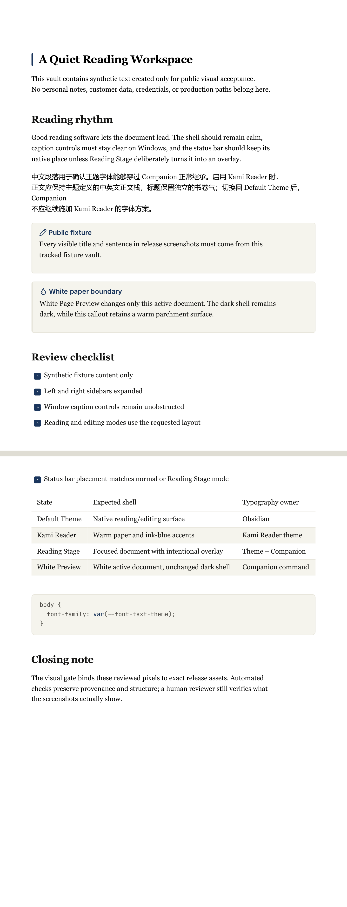

# Kami Reader — Obsidian 主题

[English](./README.md) | 简体中文

### 可选的沉浸式 Workspace 层

如果希望 New Tab、Reading、Editing、侧栏、Outline、Ribbon 与 Reading Stage
共享更连续的 Folio Shell，可选安装
[Kami Reader Companion](https://github.com/KKenny0/kami-reader-companion)。
Kami Reader 可独立使用，Companion 也支持 Obsidian Default Theme。

> **灵感来源于 [tw93/kami](https://github.com/tw93/kami)。本项目与 tw93 无关联、
> 未受其背书。所有视觉设计 token 均溯源至原 kami 项目（MIT 许可）；本仓库
> 是 kami 设计系统在 Obsidian 端的非官方 Workspace 适配。**

> 最后更新：2026-08-12 · Last updated: 2026-08-12

把 [tw93/kami](https://github.com/tw93/kami) 的印刷级排版系统——暖米纸底色、
油墨蓝点缀、衬线标题、适合屏幕长读的正文、暖调中性灰——延伸为完整的 Obsidian Workspace
外壳；不改变 Obsidian 原生导航模型。

> 当前状态：**已上线 [Obsidian Theme Gallery](https://community.obsidian.md/themes/kami-reader)。**
> 公开仓库：https://github.com/KKenny0/obsidian-kami · 开发版本：`0.3.0`（尚未发布）

---

## 视觉语言

视觉系统源自上游 [Kami](https://kami.tw93.fun/index-zh.html)。
完整 Workspace 外壳是非官方 Obsidian 适配；深色模式有意保留
`--bold-weight: 600` 以保证屏幕可读性，并不宣称与 Kami 的印刷强调规则完全一致。

| Token | 浅色 | 深色 | 用途 |
|---|---|---|---|
| Parchment / Deep Dark | `#f5f4ed` | `#141413` | 笔记主背景 |
| Ivory / Dark Ivory | `#faf9f5` | `#1a1917` | 卡片、Callout、浮层 |
| Shell Parchment | `#f0eee4` | `#1d1c1a` | 侧栏、Ribbon、标签条、状态栏 |
| Warm Sand | `#e8e6dc` | `#353330` | 边框、分割线 |
| Dark Surface / Warm Ivory | `#30302e` | `#e8e3d2` | 正文文字 |
| Ink Blue / Ink Light | `#1B365D` | `#2D5A8A` | 强调色：标题、链接、选区、CTA |
| Olive | `#504e49` | `#b4b09e` | 引用块、说明文字 |
| Warm Highlight | `#f3e3a8` | `#5a4a1f` | `==高亮==` 标记 |
| Tag Tint | `#E4ECF5` | `#E4ECF5` | 标签背景（实色，禁止 rgba） |

所有中性灰都带 yellow-brown 暖调底色（无冷蓝灰）——浅色、深色皆然。油墨蓝
是唯一强调色——印刷设计里"≤5% 面积"的克制原则在编辑器场景有所放宽，但精神
不变：只承担语义功能，绝不当装饰用。

---

## 截图预览

| 浅色 Reading View | 浅色 Editing View |
|---|---|
|  |  |

| 深色 Reading View | Callout 严重度梯度 |
|---|---|
|  |  |

| Featured Card 嵌入 | 命令面板 | 设置面板 |
|---|---|---|
|  |  |  |

| 嵌套列表任务完成态 |
|---|
|  |

| PDF 导出白纸版 |
|---|
|  |

截图已保存在 [`screenshots/`](./screenshots/)。后续发布前如需重拍，按
[`screenshots/SCREENSHOTS.md`](./screenshots/SCREENSHOTS.md) 的清单刷新。发布截图
必须使用其中定义的合成 fixture vault，禁止捕获个人或生产知识库。

---

## Style Settings

本主题内置 [Style Settings](https://github.com/obsidianmd/obsidian-style-settings) 配置 schema，把用户最可能调整的变量暴露出来，无需改 CSS。

装好 Style Settings 社区插件后，进入 **Settings → Style Settings → Kami Reader**，可调：

- **正文字体栈** —— 只控制正文；标题继续使用独立的编辑排版字体栈
- **正文行距** —— 默认 1.55，范围 1.3–1.9（Live Preview 改完需 Cmd+E toggle 一次；Reading View 立即生效）
- **笔记最大宽度** —— 默认 700px
- **加粗强调强度** —— 未使用 Style Settings 覆盖时，浅色默认 500、深色默认 600；可按当前字体需要选择 500、600 或 700
- **强调色**（浅色 + 深色）—— 单色替换，瞬间改变主题气质
- **主背景**（浅色 + 深色）—— 调 parchment 暖度

Schema 刻意只暴露 6 个高杠杆变量。其他保持 `theme.css` 内固定，以维护 kami 的克制原则：过度可配置会稀释设计系统的统一性。

<details>
<summary>维护者说明：schema 放在哪里</summary>

- **Snippet 模式**：schema 内嵌为 `theme.css` 头部的 `/* @settings ... */` YAML 注释。Style Settings 不会扫描 `.obsidian/snippets/` 找独立 JSON 文件，所以 snippet 安装需要把 schema 放在 CSS 里。
- **Theme 模式**：schema 在根目录 `data-theme.json`。Obsidian 从 `.obsidian/themes/kami-reader/` 加载主题时读取它。

修改用户可见设置时，要保持两份 schema 同步。
</details>

---

## 字体系统

```css
--font-text-theme: "Charter", "Georgia",
                   "Source Han Sans SC", "Noto Sans CJK SC",
                   "PingFang SC", "Microsoft YaHei", sans-serif;

--font-heading-theme: "Charter", "Georgia",
                      "TsangerJinKai02",
                      "LXGW WenKai Screen", "LXGW WenKai",
                      "Source Han Serif SC", "Noto Serif CJK SC", serif;
```

- **Charter** — 英文衬线。macOS 自带（`/System/Library/Fonts/Charter.ttc`），
  无需安装。其他平台 fallback 到 Georgia。这也是 kami 原版为英文指定的字体。
- **思源黑体 / 系统黑体** —— 中文正文默认栈，优先照顾 Windows 长时间阅读。
- **LXGW WenKai Screen** —— 中文标题字体，OFL 1.1；保留 Kami 的手写温度，
  但不再让每一段正文都使用楷书。
- **JetBrains Mono** — 代码字体，OFL 1.1。
- **Inter** — UI / 界面字体，OFL 1.1。

### 可选字体安装

只有可选的标题质感需要手动安装 LXGW WenKai Screen；正文会直接回退到平台
自带的中文黑体，不需要额外配置。

- **LXGW WenKai Screen** — https://github.com/lxgw/LxgwWenKai-Screen/releases
  （下载 `LXGWWenKaiScreen-Regular.ttf` + `Bold.ttf`，双击安装）
- JetBrains Mono（可选，代码已 fallback 到 SF Mono / Cascadia）：
  https://www.jetbrains.com/lp/mono/

---

## 安装

### 从 Obsidian Theme Gallery 安装（推荐）

1. Obsidian → **Settings → Appearance** → Themes 旁点 **Manage**
2. **Browse** → 搜索 "Kami Reader" → **Install** → **Use**
3. （可选）装 [Style Settings](https://obsidian.md/plugins?id=obsidian-style-settings) 社区插件，启用 6 个可调变量（字体、行距、宽度、加粗强调、强调色、背景）

Gallery 安装不受下面提到的 macOS Sequoia 沙盒问题影响。主题文件由 Obsidian 自己写入，所以 App Store 用户可以从 Browse Themes 正常安装 Kami Reader。

### 手动安装 / 开发者迭代（macOS Sequoia 沙盒绕过）

> ⚠️ **这一节存在的理由。** App Store 版 Obsidian 跑在沙盒里。macOS Sequoia
> 15+ 会给所有从终端用 `cp` 创建的文件打上 `com.apple.provenance` 属性，沙盒
> 据此拒绝加载这些文件作为主题资源——Obsidian 静默跳过这个主题文件夹。这只
> 影响**在本地 vault 里迭代 theme.css 的开发者**。从 Gallery 安装的终端用户
> （上面那条路径）不受影响。

本地迭代的绕过方案：把 kami 作为 **CSS snippet** 发布（不是主题），通过
Obsidian 自己的 Vault API 从 DevTools console 注入。`app.vault` 写入的文件
provenance 是 Obsidian 本身，沙盒正常放行。

#### 一次性配置

1. 确认 Settings → Appearance → Themes 设为 **Default**（不要保留其他主题；
   其他主题的 `body.<name>-theme` class 选择器特异性高于 kami 的
   `body.theme-light`，会压制 kami 的样式）。
2. 在本仓库目录下，生成注入脚本：
   ```bash
   ./sync.sh
   ```
3. 打开生成的 `inject-kami-snippet.js`，`Cmd+A` 全选，`Cmd+C` 复制。
4. 在 Obsidian 里：`Cmd+Option+I` → Console 标签 → `Cmd+V` 粘贴 → 回车。
   看到提示 `✓ kami.css created (... chars)` 即成功。
5. Settings → Appearance → 滑到底部 **CSS Snippets** → 开启 **kami** 开关。

#### 改 CSS 后的迭代流程

```bash
# 编辑 theme.css 后：
./sync.sh
# 重新复制 inject-kami-snippet.js 全部内容 → 粘贴到 Obsidian Console。
# 然后在 CSS Snippets 里把 kami 开关关掉 → 再开启，强制重新加载新内容。
```

修改后的 snippet **不会**自动热重载——Obsidian 只在启动时读一次 snippet
文件。通过 `app.vault.modify` 重新注入后，需要在 Settings → Appearance →
CSS Snippets 把 kami 开关 toggle 一次才能拉到新内容。

---

## 覆盖范围

当前覆盖范围包含完整 Workspace 外壳：

- ✅ 基础色板（60+ 变量，浅色 + 深色双套）
- ✅ **深色模式** —— Deep Dark `#141413` + Ink Light `#2D5A8A`，保留同样的
  yellow-brown 暖调底色和单色克制原则
- ✅ Reading View：标题、正文、列表（原生 marker）、表格、引用块
  （2pt 油墨蓝实线 + olive 文字，无背景）、代码、frontmatter、嵌入块
- ✅ Editing View（CodeMirror 6）：语法 token、光标、选区、当前行高亮、
  格式化符号
- ✅ **完整 Workspace 外壳**：标题栏、根标签与侧栏标签、功能区、左右侧栏、
  pane 分割线、文件管理器/搜索、View Header 与贴边状态栏
- ✅ 命令面板、Quick Switcher、设置面板、modal、菜单、toggle、checkbox、滚动条
- ✅ 打印 / PDF 导出：浅色与深色主题都输出白纸，卡片、代码、frontmatter、
  嵌入、Callout 与表格偶数行保留暖米纸层级
- ✅ 尊重系统的 reduced-motion 偏好

未覆盖（暂缓）：
- 插件特化样式（Dataview、Templater、Excalidraw）—— 遇到再说

---

## 发布说明

Kami Reader 已上线 Obsidian Theme Gallery：
https://community.obsidian.md/themes/kami-reader。

Obsidian 会从与 `manifest.json.version` 完全一致的 GitHub release tag 拉主题文件，
tag 不带 `v` 前缀。

<details>
<summary>维护者历史：Gallery 提交与 lint 修复</summary>

主题已于 2026-06-20 通过 `community.obsidian.md` 发布。该站点会通过
Obsidian 的每小时 mirror workflow，把通过审核的主题同步到
`obsidianmd/obsidian-releases`。

Theme Gallery 下载路径也验证过 macOS Sequoia 沙盒问题：fresh Gallery 安装
写出的 `theme.css` 没有 `com.apple.provenance`，所以 App Store 用户可以从
Gallery 正常安装。snippet 绕过方案只影响开发者手动迭代。

community.obsidian.md 提交时跑自动 lint。每个 warning 都需要单独修复 + 新
release tag：

| Release | Lint warning | 修复 |
|---|---|---|
| `0.1.0` | No release matches manifest version | 创建 GitHub release，tag = `0.1.0`（不带 v 前缀） |
| `0.1.1` | Repository has no recognized license | 恢复纯 MIT LICENSE（GitHub licensee 严格匹配 MIT 模板；附加的 attribution 段落破坏了匹配） |
| `0.1.1` | `css-scrollbar` partially supported by Obsidian 1.4.5 | 删除 CSS Scrollbars spec 属性（`scrollbar-width`、`scrollbar-color`）；保留 webkit `::-webkit-scrollbar` vendor extension |
| `0.1.2` | Avoid `!important` at theme.css:788, 1105, 1106 | CodeMirror selection 用 0,3,0 特异性复合选择器；reduced-motion 用显式 selector list 替代 `* !important` |

</details>

---

## 设计决策

1. **基于 Obsidian Default 派生，不是 Minimal。** Minimal 自带设计语言，
   把 parchment 注入进去会产生视觉撕裂。Minimal 还用 `body.minimal-theme`
   class 选择器（特异性 0,1,1）压制 kami 旧版的 `:root`（0,0,1）。Default
   没有这种 class。
2. **变量定义在 `body.theme-light` / `body.theme-dark` 上，不是 `:root`。**
   Obsidian 内置 app.css 把基础变量定义在 `.theme-light` / `.theme-dark`
   （特异性 0,1,0）下。`:root`（0,0,1）层叠不过它们；`body.theme-light`
   （0,1,1）才行。
3. **正文与标题分成两个契约。** `--font-text-theme` 继续作为用户可见的正文
   控制；`--font-heading-theme` 负责 H1–H6 与 inline title，不增加新的设置项。
4. **标签背景用实色 `#E4ECF5`，绝不用 rgba。** kami 明确禁止 rgba 标签
   背景（PDF 导出时 WeasyPrint 有双层矩形 bug）。
5. **阴影只用 ring shadow 和 whisper shadow，绝不用硬投影。** kami 规范；
   硬投影在印刷品和屏幕上都显得过重。
6. **Reading View 和 Live Preview 都保留原生列表 marker。** 只在 Reading
   View 换成短横线会让编辑态和阅读态割裂；现在用更轻的 marker 颜色和更紧的
   深层缩进来保留 kami 的克制感。
7. **引用块：2pt 油墨蓝实线 + olive 文字，无背景，不 italic。** 克制优于装饰。
8. **中文正文用黑体，标题用楷书/衬线。** 长段落更适合屏幕阅读，标题仍保留
   Kami 标志性的手写温度。
9. **不用合成粗体。** kami 禁止 fake bold；标题只用 500/600 实际字重。深色模式
   有意保留 `--bold-weight: 600` 作为 Obsidian 的屏幕可读性例外。
10. **Phase 1 以 snippet 形式发布，不是主题。** 绕过 macOS Sequoia 沙盒；
    详见"安装"章节。

---

## 已知取舍

1. **Parchment 背景比多数编辑器主题更暖。** 如果长时间使用觉得偏黄，可以在
   Style Settings 里调整 **主背景**。
2. **标题仍比正文更有书卷气。** 如果希望整篇都使用无衬线，可在 CSS snippet
   中覆盖 `--font-heading-theme`。
3. **加粗按主题校准：** 未使用 Style Settings 覆盖时，浅色保持克制的 `500`，
   深色使用更易辨识的 `600`。如果你的平台或字体需要不同校准，可在 **加粗强调强度**
   中选择 `500`、`600` 或 `700`。

---

## 文件结构

```
kami-obsidian/
├── manifest.json              # 主题元数据（name, version, minAppVersion）
├── theme.css                  # 所有 kami 样式的唯一源文件 + 内嵌 @settings YAML
├── data-theme.json            # Style Settings schema，theme 模式用
├── sync.sh                    # 从 theme.css 重新生成 inject-kami-snippet.js
├── inject-kami-snippet.js     # sync.sh 的产物 —— 粘贴到 Obsidian Console 用
├── screenshots/               # 发布证据集（见 SCREENSHOTS.md）
├── LICENSE                    # MIT（纯文本，让 GitHub licensee 识别 SPDX:MIT）
├── README.md                  # 英文文档
└── README.zh-CN.md            # 本文件
```

`inject-kami-snippet.js` 是**构建产物**，不是源文件。任何 `theme.css` 改动后
跑 `./sync.sh` 重新生成即可。

---

## Releases

| Tag | 说明 |
|---|---|
| [0.1.0](https://github.com/KKenny0/obsidian-kami/releases/tag/0.1.0) | Phase 1：视觉系统 + 深色 variant + 原子组件 + Style Settings |
| [0.1.1](https://github.com/KKenny0/obsidian-kami/releases/tag/0.1.1) | 兼容性：删 CSS Scrollbars spec 适配 Obsidian 1.4.5；恢复纯 MIT LICENSE |
| [0.1.2](https://github.com/KKenny0/obsidian-kami/releases/tag/0.1.2) | Lint 合规：去掉 CodeMirror selection 和 reduced-motion 的 !important |
| [0.1.3](https://github.com/KKenny0/obsidian-kami/releases/tag/0.1.3) | 体验打磨：统一嵌套列表层级、修复外链图标重叠，并避免已完成父任务把子内容一起划掉 |
| [0.1.4](https://github.com/KKenny0/obsidian-kami/releases/tag/0.1.4) | Lint 合规：移除已完成任务里的高成本选择器，同时保留子任务内容可读性 |
| [0.1.5](https://github.com/KKenny0/obsidian-kami/releases/tag/0.1.5) | 性能：移除全局文字渲染覆盖，改善长文滚动流畅度 |
| [0.1.6](https://github.com/KKenny0/obsidian-kami/releases/tag/0.1.6) | 长文阅读体验：校准长文排版、行内代码、代码块、表格、标题层级和加粗强调 |
| [0.1.7](https://github.com/KKenny0/obsidian-kami/releases/tag/0.1.7) | 可读性校准：恢复 700px 阅读宽度、500 加粗约束，并放松长文阅读节奏 |
| [0.1.8](https://github.com/KKenny0/obsidian-kami/releases/tag/0.1.8) | Style Settings：新增加粗强调强度控制，用于字体和平台差异下的可读性校准 |
| [0.1.9](https://github.com/KKenny0/obsidian-kami/releases/tag/0.1.9) | 阅读体验：恢复 Reading View 原生段落节奏、校准深色加粗，并在完整 Kami snippet 与活动主题重叠时给出警告 |
| [0.2.0](https://github.com/KKenny0/obsidian-kami/releases/tag/0.2.0) | Workspace 外壳：把 Kami 视觉语言延伸到导航、侧栏、pane、页头、状态区与核心浮层 |
| [0.2.1](https://github.com/KKenny0/obsidian-kami/releases/tag/0.2.1) | Style Settings：修复内嵌 YAML 元数据，确保 Kami Reader 配置区在 Windows 上可靠加载 |
| `0.3.0`（未发布） | 字体分层、收敛 Workspace 层级、提升被动图标可见性，并加入白纸 PDF 导出 |

Release tag 跟 `manifest.json` version 完全一致（不带 `v` 前缀）——Obsidian 从
manifest version 对应的 GitHub release tag 拉主题文件。

---

## License

MIT —— 见 [LICENSE](./LICENSE)。

视觉设计系统来源：[tw93/kami](https://github.com/tw93/kami)（MIT）。本主题是
衍生适配，所有设计 token 值溯源至原 kami 项目。

引用但不打包的字体：
- Charter（OFL，macOS 自带）
- LXGW WenKai / LXGW WenKai Screen（OFL，https://github.com/lxgw/LxgwWenKai）
- JetBrains Mono（OFL）
- Inter（OFL）

---

## 致谢

- 视觉风格与设计 token：[tw93/kami](https://github.com/tw93/kami) —— MIT。
  本项目是非官方第三方适配，见
  [Kami 原作者的公开回复](https://github.com/tw93/Kami/issues/42#issuecomment-5158906154)。
- 字体：Charter（OFL，macOS 自带）、LXGW WenKai（OFL）、JetBrains Mono（OFL）、
  Inter（OFL）
